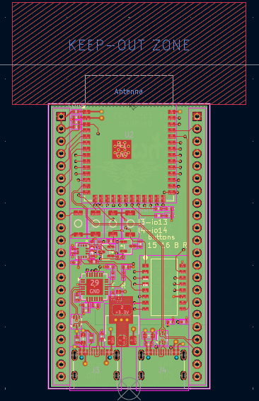
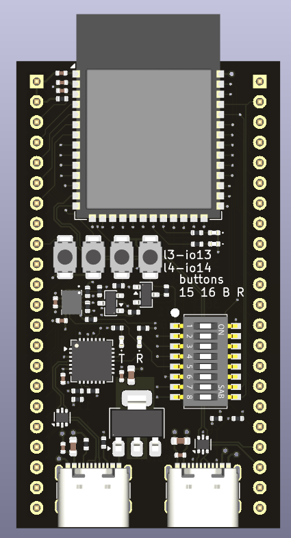
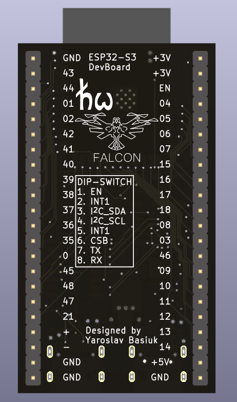
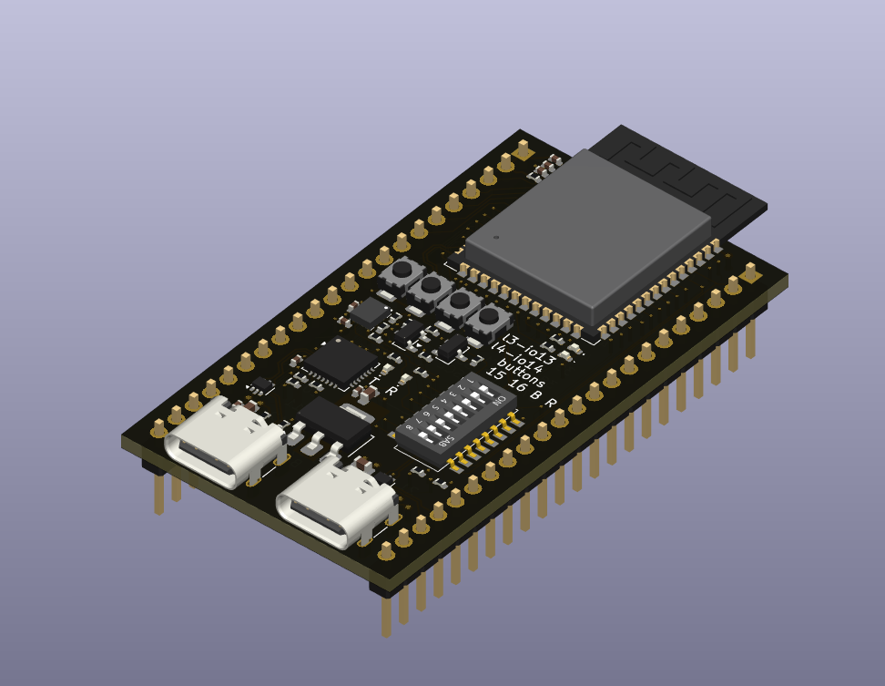
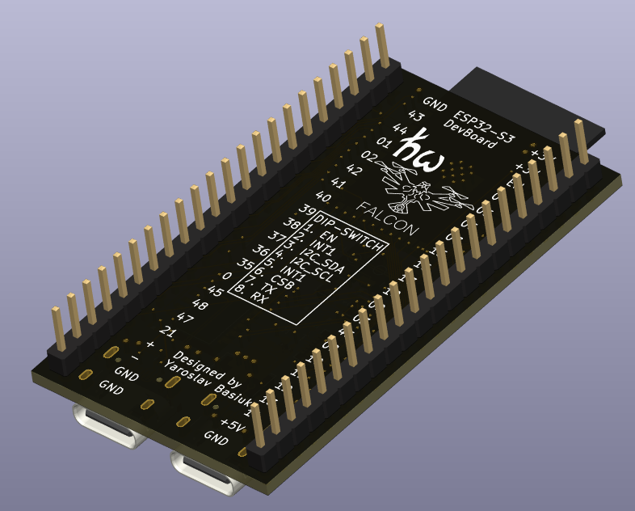

# ESP32-S3 DevBoard (Recruitment Task)

This project is a custom development board based on the ESP32-S3, created as part of a recruitment task.  
Although the task was intended for candidates, I also completed it myself as a reference and benchmark solution.

## Overview

The board is based on the **ESP32-S3-WROOM-1** module and follows the general idea of standard development boards.

The pinout is **fully compatible with the original ESP32-S3 dev boards**, so it can be used as a drop-in replacement in typical setups.

## Features

- ESP32-S3-WROOM-1 module
- 2x USB Type-C connectors for power, programming, and communication OTG
- USB-to-UART converter based on **CP2102N** with auto-programming circuit
- IMU sensor (BMI270) connected via **I2C**
- 2x user LED indicators (0403) and UART led indicators
- Reset, boot and 2 users buttons
- DIP switch for flexible configuration

## Configuration (DIP Switch)

The board includes a DIP switch that allows:

- Enabling/disabling the USB-to-TTL converter  
- Enabling/disabling the IMU sensor  
- Powering off the ESP32 (useful when using the board purely as a USB-UART converter)

## IMU

An IMU sensor (BMI series) has been added and connected via the I2C interface.  
This allows easy integration of motion sensing features in future projects.

## USB to UART

The board includes a **CP2102N** USB-to-TTL converter with an auto-programming circuit, enabling:

- Firmware flashing
- Serial communication
- Seamless development workflow

## PCB Layout

Below are renders and layout views of the board:

### Layout

### 3D Views

#### Top View

#### Bottom View

#### Isometric Top

#### Isometric Bottom

## Notes

This project was created as part of a recruitment process to evaluate practical hardware design skills, including:

- schematic design
- PCB layout
- manufacturability
- documentation

## License

This project is licensed under the GNU Lesser General Public License v2.1 (LGPL-2.1).

You are free to use, modify, and distribute this project under the terms of this license.
